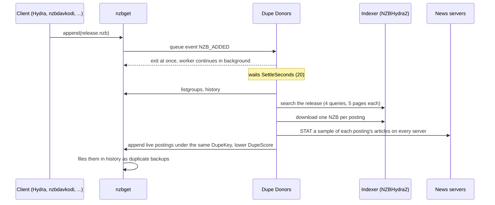

# Dupe Donors (nzbget extension)

Dupe Donors is an nzbget queue extension. When a download is added, it finds the other postings of the same
release, checks how much of each one still exists on your news servers, and adds the live ones as nzbget
duplicate backups, most complete first. When the download fails, nzbget switches to the best backup. With
the PR 850 build of nzbget, nzbget also borrows missing articles from the backups.

The extension runs inside nzbget's own extension system. It needs no separate service, no proxy port, and
no change to your downloaders. It handles every NZB that reaches nzbget, from NZBHydra2, nzbdavkodi, an RSS
feed, or a manual upload.

## Contents

- [How it works](#how-it-works)
- [Requirements](#requirements)
- [Install](#install)
- [Configure](#configure)
- [Read the log](#read-the-log)
- [Scores](#scores)
- [Limits](#limits)
- [Develop](#develop)
- [License](#license)

## How it works



1. **The event.** nzbget runs the extension for `NZB_ADDED`. nzbget runs only one queue extension at a time,
   so the extension starts a detached worker and exits immediately. Downloads and other extensions never
   wait for the search.
2. **The pick.** After `SettleSeconds`, the worker reads nzbget's queue and history. It acts only when the
   new item is a pick:
   - The item has not reached post-processing yet.
   - The item has the highest `DupeScore` of its `DupeKey`. Backups that a client sends along with its
     pick, and backups that nzbget promotes after a failure, rank lower and are left alone.
   - Dupe Donors did not add the item itself.

   An item without a `DupeKey` gets `dupes:<normalized title>`. An item scored below `PrimaryScore` is
   raised to it.
3. **The search.** The worker searches the indexer with the normalized title, a short title, the short
   title plus the release group, and the IMDb or TVDB ID when the NZB has one. Results that are a different
   release are dropped by comparing parsed release names: title, episode, group, resolution, HDR format,
   and so on. Sizes are not compared, because postings of one release can differ by gigabytes.
4. **The NZB downloads.** Listings with the same size and a posting time within two minutes are one
   posting listed by several indexers, so the worker downloads one NZB per posting. Each indexer has one
   download in flight at a time. An indexer that answers HTTP 403 or 429 has reached its grab limit and is
   skipped for 30 minutes.
5. **The filters.** The worker rejects an NZB if:
   - its largest file is a different release;
   - nzbget already holds that posting;
   - the posting was found dead in the last three days;
   - it shares articles with the pick or an accepted donor.
6. **The health check.** The worker asks every news server in nzbget's settings about a sample of each
   posting's articles, all servers at once:
   - first a 10-article probe;
   - then 5% of the articles, from 50 to 1,000;
   - plus up to 20 article downloads with yEnc CRC verification.

   A posting with nothing left is dropped. A pick with nothing left is demoted, so the best donor takes over.
7. **The ranking.** Live postings are added under the pick's `DupeKey`. The five quickest are added after
   their probe, and the rest after their full sample. When every check is in, all donors are re-scored
   strictly in order of completeness.

Workers run one at a time, using a lock in the state folder, so the health checks never use more than half
of each news server's connections, even when several downloads arrive together.

## Requirements

- nzbget 24 or newer, with `DupeCheck=yes`.
- Python 3.8 or newer on the nzbget host. No packages are installed: the extension uses the Python standard
  library and the bundled `vendor/` copies of PTT and cyclops.
- A newznab indexer or aggregator. NZBHydra2 is recommended, because one search covers all your indexers.
- nzbget's control username and password set (`ControlUsername`, `ControlPassword`). The extension uses them
  to talk to nzbget's JSON-RPC API.

## Install

1. Copy this folder into nzbget's `ScriptDir` as `DupeDonors`:

   ```bash
   cp -R nzbget_extension /path/to/nzbget/scripts/DupeDonors
   ```

2. In the nzbget web interface, go to **Settings**, then switch to **Downloads** and back to **Settings**,
   so nzbget re-reads the extension list.
3. Open **Dupe Donors** in the settings menu. Set `HydraUrl` and `HydraApiKey`, and save.
4. In **Settings** → **EXTENSION SCRIPTS**, add `DupeDonors` to the `Extensions` option, and save. nzbget
   reloads.
5. Click **Test connection** on the Dupe Donors settings page. It checks that the indexer answers and lists
   the news servers used for health checks.

To try it without changing anything in nzbget, set `DryRun` to `yes`. The extension then searches and
checks, and only logs what it would add.

## Configure

| Option | Default | Description |
|---|---|---|
| `HydraUrl` | empty | Base URL of the newznab indexer, for example `http://127.0.0.1:5076`. |
| `HydraApiKey` | empty | API key of the indexer. |
| `MaxDonors` | `0` | Most donors to add per download. `0` means no limit. |
| `SizeTolerance` | `0` | `0` means size is not a filter. `0.2` skips results more than 20% off in size. |
| `HealthPercent` | `5` | Share of each posting's articles to check. `0` turns health checks off. |
| `HealthMinArticles` | `50` | Fewest articles to check per posting. |
| `HealthMaxArticles` | `1000` | Most articles to check per posting. |
| `BodyPercent` | `20` | Share of checked articles that are also downloaded and verified. |
| `BodyMaxPerNzb` | `20` | Most article downloads per posting, each about 750 KB. |
| `DonorMinAlive` | `0.5` | Postings with less than this share of their articles alive are dropped. |
| `HealthBudget` | `120` | Seconds of checking per posting. |
| `FastDonors` | `5` | Donors added right after their quick probe. |
| `NzbsToCheckConcurrently` | `10` | Postings checked at the same time. |
| `NntpServerConnectionPerNzb` | `1` | Connections per news server for each posting being checked. |
| `MaxConnsPerNntpServer` | `20` | Most check connections per news server. Never more than half of the server's `Connections`. |
| `PrimaryScore` | `1000000` | `DupeScore` given to a pick that has no `DupeKey` or a lower score. |
| `SettleSeconds` | `20` | Seconds to wait after a download is added before searching. |
| `DryRun` | `no` | `yes` logs what would be added without changing anything. |
| `StateDir` | empty | Folder for the state file and the log. Empty means `MainDir/dupe-donors`. |

## Read the log

The worker writes to nzbget's **Messages** tab, prefixed with `DupeDonors:`, and to
`dupe-donors.log` in the state folder. API keys and passwords are masked. Each search ends with one summary
line:

```text
DupeDonors: append key=... nzbid=2366 title=... results=195 candidates=23 verified=5 added=5
rejected={'relisted': 6, 'in-nzbget': 10, 'refused': 4, 'dead': 2}
```

| Key | Meaning |
|---|---|
| `relisted` | Another indexer's listing of a posting already downloaded. Not downloaded again. |
| `refused` | Skipped, because the indexer reached its grab limit within the last 30 minutes. |
| `fetch`, `parse` | The NZB download failed, or the reply was not an NZB. |
| `listing-mismatch` | The indexer served an NZB of a different size than it lists. |
| `other-release` | The NZB's main file is a different release. |
| `in-nzbget` | nzbget already holds this posting. |
| `known-dead` | The posting was found dead in the last three days. |
| `same-posting` | Shares articles with the pick or another donor. |
| `dead` | Too little of the posting is left on any news server. |

## Scores

nzbget tries backups in `DupeScore` order and only switches to a backup scored at least `pick score × health
/ 1000`. Donors therefore score just below the pick:

| Item | `DupeScore` |
|---|---|
| Pick | Its own score, or `PrimaryScore` |
| Donor | pick − 1000 + 9 + 80 × alive share (+1 for a byte-identical twin of the pick) |
| Dead donor, or a dead pick after demotion | pick − 999 |

Each donor also gets the post-processing parameter `DupeAlive`, the measured share of its articles that
exist, from 0 to 100. A pick whose NZB can't be told apart from another posting of exactly the same size is
never demoted.

## Limits

- The extension only adds donors. It never deletes anything from nzbget.
- Health checks sample articles. A small share of missing articles can go unnoticed, and nzbget's repair
  covers those.
- Each search downloads NZBs from your indexers, which counts against their grab limits.
- With `ArticleRetries=0`, nzbget counts every article timeout as a failure. A posting that is fully alive
  can then look damaged. Keep `ArticleRetries` at 3 or more.

## Develop

`main.py` is the extension entry point. The donor discovery itself is in `nzbget_dupe_proxy.py` (search,
release matching, NZB downloads, filters, scoring) and `donor_health.py` (the parallel news-server health
check). Both use only the Python standard library and the bundled `vendor/` folder:

- `vendor/ptt/` is [PTT](https://github.com/dreulavelle/PTT), MIT licensed, the release-name parser.
- `vendor/cyclops/` is the async NNTP `STAT`/`BODY` client used for health checks.

To try a change without nzbget, run the connection test from a shell:

```bash
NZBCP_COMMAND=ConnectionTest NZBPO_HydraUrl=http://127.0.0.1:5076 NZBPO_HydraApiKey=YOUR_KEY \
NZBOP_CONTROLPORT=6789 NZBOP_CONTROLUSERNAME=nzbget NZBOP_CONTROLPASSWORD=YOUR_PASSWORD python3 main.py
```

## License

Dupe Donors is licensed under the GNU General Public License, version 2. See [LICENSE](LICENSE).

The bundled `vendor/ptt/` is MIT licensed; its license is in `vendor/ptt/LICENSE`.
